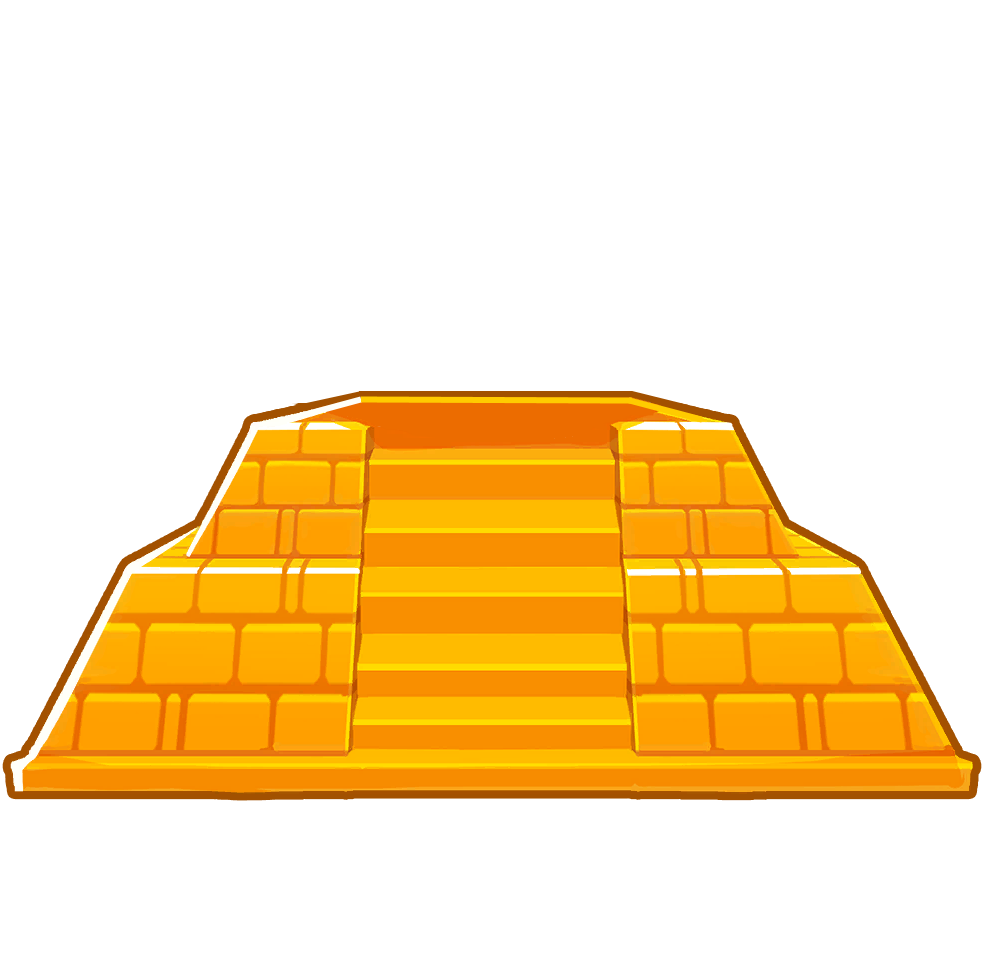

<h1 align="center">Temple Base</h1>

Adds in the Temple Base, a tower that lets you place another tower on top of it to power it up like a Sun Temple.

Features 15 Upgrades. Paragon coming at a later time.

